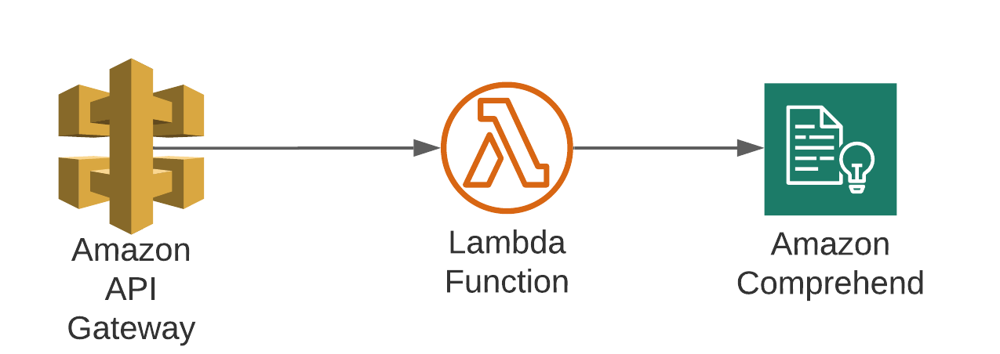
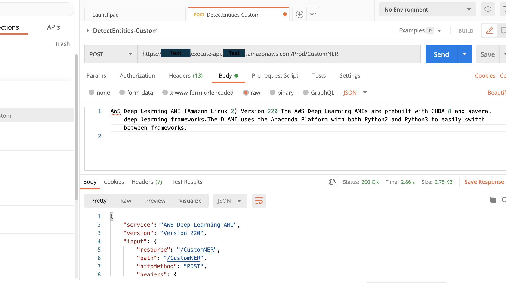

# Amazon Comprehend custom entity recognizer real time public API sample code

## Overview

As announced [here](https://aws.amazon.com/about-aws/whats-new/2020/07/amazon-comprehend-launches-real-time-custom-entity-recognition/), Amazon Comprehend now supports real time Custom Entity Recognition. You can use the real time Custom Entity Recognition to identify terms that are specific to your domain in real time. For example, you can instantly extract product names, financial entities or any term relevant to you from unstructured text documents. Prior to this launch, Custom Entity Recognition identified business-specific entities in text documents asynchronously. Now, customers can choose real time or asynchronous Custom Entity Recognition depending on their use case. 

Here, I am showing how to invoke an Amazon comprehend custom entity recognizer service API in real time using a public rest endoint and lambda function. I have used 'Python 3.6' as Lambda function's runtime Enviorement and sample code is there in the code folder.You can use this sample code to fetch your custom entities from your's Comprehend Custom Entity Recognizer in similar setup. 

## Getting Started

In order to demostrate this functionality, I have used below architecture where Amazon API Gateway is calling the Lambda function in real time which in turn calls the Comprehend CUstom Entity recognition API in real time. To build an API with Lambda integrations, you can use Lambda proxy integration or Lambda non-proxy integration with Amazon API Gateway. I have used 'Lambda proxy integration' here.

 

### Prerequisites

1. Please go through this [blog](https://aws.amazon.com/blogs/machine-learning/announcing-the-launch-of-amazon-comprehend-custom-entity-recognition-real-time-endpoints/) which tells how to build an Amazon Comprehend custom entity recognition model and set up an Amazon Comprehend Custom Entity Recognition real time endpoint for synchronous inference. I have used the same to train my model and generate the endpoint which is used in the lambda function.You can create your own custom model and endpoints using your own training data also by folowwing above blog.

2. Please go through the tutorial documentation [link](https://docs.aws.amazon.com/apigateway/latest/developerguide/api-gateway-create-api-as-simple-proxy-for-lambda.html), which depicts on how to create an Lambda proxy integration with Amazon API gateway. Lambda function code is shared in 'code' folder.

3. As I have used Python 3.6 as my Lambda function runtime hence some knowledge of python 3 version is required.

### Steps

1. First create the Amazon Comprehend custom entity recognition model and set up an Amazon Comprehend Custom Entity Recognition real time endpoint for synchronous inference. Pleae follow instaruction given in pre-requisite point #1 for the same. For specific to your use case you can create your own custom model with your training dataset.

2. Create the Lambda function using the sample code provided in the code folder.Please replace the 'EndpointArn' and 'region_name' values in lambda function code as these will be specific to your case.

if you face error like "unknown service", "parameter validation failed", or "object has no attribute" errors with your Python (Boto 3) Lambda function, please follow this [instruction](https://aws.amazon.com/premiumsupport/knowledge-center/lambda-python-runtime-errors/) for the same.

3. Create Amzon API Gateway and Lambda Integration using instruction provided in pre-requisie point #2.

4. Test it using Postman. Please see doccumention link [here](https://docs.aws.amazon.com/apigateway/latest/developerguide/how-to-use-postman-to-call-api.html) on how to use Postman to call AWS Rest APIs.

5. Once succesfully tested, you can use the same setup to get custom entities in real time for your own custom models too.

## Running the tests

While running the test via postman you need to pass the input string as the body and you will get required custom entities as response. In this case my custom entities are 'service' and 'version' which are visible in response sent by Lambda function:

## Contributing

Please read [CONTRIBUTING.md](https://gist.github.com/PurpleBooth/b24679402957c63ec426) for details on our code of conduct, and the process for submitting pull requests to us.

## License

This library is licensed under the MIT-0 License. See the LICENSE file.

## Acknowledgments

* Thanks to Mona Mona and Prem Ranga's [blog](https://aws.amazon.com/blogs/machine-learning/announcing-the-launch-of-amazon-comprehend-custom-entity-recognition-real-time-endpoints/) to build an Amazon Comprehend custom entity recognition model and set up an Amazon Comprehend Custom Entity Recognition real time endpoint for synchronous inference.

